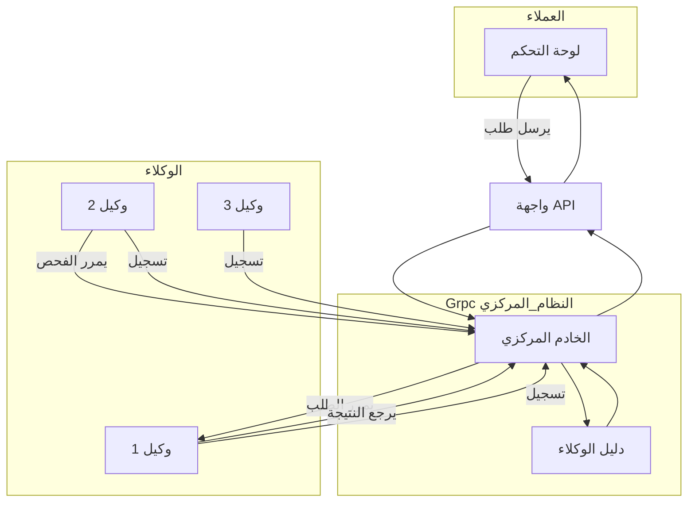

#  التصور الكامل والنهائي: منصة الإدارة المركزية للوكلاء

##  1. الرؤية - (وايش بنسوي؟)

نحن بنبني منصة مركزية تكون زي **برج المراقبة** لجميع الأجهزة والخدمات اللي موزعة في الشركة، سواء كانت خلف جدران نارية أو في شبكات خاصة.  
الهدف هو: **إدارة وتحكم لحظي وآمن** من أي مكان.

---

##  2. المشكلة اللي بنحلها

الأصول التقنية في الشركة (أجهزة، سيرفرات، برامج، شبكات) متفرقة وصعب الوصول لها.  
التحديثات بطيئة، التشخيص مكلف، والأمان معرض للخطر.  
المنصة هذه بتكون **حل جذري** لهذي المشاكل من الأساس.

---

##  3. مكونات النظام الأساسية

النظام بيكون مكوّن من 3 خدمات رئيسية، وكل وحدة لها دورها:

### 1️ الوكيل (Agent) – نقطة البداية
- **وش هو؟** برنامج شغال في الأجهزة الطرفية.
- **وظيفته:** يتواصل مع المركز ويبلغ إنه متصل 
  **المراقبة والإبلاغ الاستباقي:** يراقب النظام المحلي بشكل مستمر، وفي حال اكتشاف أي نشاط مشبوه (مثل فيروس أو ملف غير معروف)، يقوم بإبلاغ الخادم المركزي فوراً.
- **مهمتنا:** نفهم كيف يتكلم هذا الوكيل (لغة الاتصال – البروتوكول).

---

### 2️ المركز (Central Hub) – عقل النظام
- **وش هو؟** خادم رئيسي نطوره باستخدام gRPC.
- **وظيفته:**
  - **تسجيل:** يتحقق من هوية كل وكيل، ويسجله في "دليل الأحياء".
  - **وسيط (Proxy):** يستقبل الأوامر من العملاء ويمررها للوكلاء المناسبين.
  -  **تحليل التهديدات المتقدم:** يستقبل التقارير الأمنية من الوكلاء، ويقوم بفحص متقدم للملفات المشبوهة (مثلاً، عبر خدمات خارجية مثل VirusTotal)، ويتخذ الإجراء المناسب.

---

### 3️ واجهة التحكم (Control API) الي هيه api gatway الي هيه firewal 

- **وش هي؟** بوابة خارجية للنظام مبنية باستخدام gRPC.
- **وظيفتها:** تسمح لأي نظام خارجي (Dashboard أو برنامج آلي) يرسل أوامر أو يطلب معلومات عن الوكلاء.

---

## 4. آلية العمل – كيف يشتغل النظام؟

###  التسجيل (Registration)
    عندما يتم تشغيل وكيل جديد لأول مرة، يجب عليه تسجيل نفسه في الخادم المركزي.
- الوكيل يبدأ الاتصال.
- المركز يتحقق منه ويسجله.
- الوكيل يظل "متصل بالشبكة" وجاهز يستقبل أوامر.

---

####  5.آلية الإبلاغ عن التهديدات (Threat Reporting Workflow)

بالإضافة إلى استقبال الأوامر من المركز، يمتلك الوكيل القدرة على بدء التواصل بنفسه في حال اكتشاف تهديد أمني. تتم هذه العملية عبر الخطوات التالية:

1. **المراقبة المحلية:** يقوم الوكيل بمراقبة مستمرة للعمليات الحساسة على الجهاز، مثل تثبيت برامج جديدة أو إنشاء ملفات تنفيذية.
2. **الفحص الأولي:** عند اكتشاف ملف جديد، يستخدم الوكيل مجموعة قواعد محلية للتعرف على الفيروسات المعروفة.
3. **الإبلاغ المباشر:** إذا تطابق الملف مع فيروس معروف، يقوم الوكيل فوراً بإرسال تقرير إلى الخادم المركزي بنتيجة الفحص ونوع التهديد.
4. **تصعيد الاشتباه:** إذا كان الملف غير معروف ولكنه مشبوه (مثلاً، يحاول القيام بعمليات غير مسموح بها)، يقوم الوكيل بإرسال تقرير إلى الخادم المركزي مع **إرفاق نسخة من الملف نفسه** لتحليل أعمق.
5. **التحليل المتقدم:** يستقبل الخادم المركزي الملف، ويستخدم أدواته المتقدمة (مثل الربط مع واجهة VirusTotal API) لفحصه بشكل دقيق وتحديد ما إذا كان خبيثاً أم لا.
6. **تسجيل وتنبيه:** بناءً على نتيجة الفحص النهائي، يقوم الخادم بتسجيل الحدث في سجلات الأمان وإنشاء تنبيه لمدير النظام لاتخاذ الإجراء اللازم.
---
#### 6.طبيعة الاتصال: قناة خاصة ومستمرة(Streaming)

عشان نظامنا يكون لحظي وفعال، طريقة الاتصال بين الوكيل والمركز ما بتكونش طلبات متقطعة ورسمية كل مرة الي بتطلق عليها الاستقصاء (Polling) بدلاً من ذلك، أول ما الوكيل يشتغل، بيفتح قناة اتصال مباشرة ومستمرة مع المركز.

فكر فيها كأن الوكيل فتح "خط تلفون خاص" مع غرفة العمليات. هذا الخط يظل مفتوح على طول، وهذا يدينا ميزتين أساسية:

1. **قناة ثنائية الاتجاه (Two-Way Street):** عبر نفس الخط المفتوح، الوكيل يقدر يرسل بياناته للخادم (زي التسجيل ونبضات القلب ونتائج الأوامر)، وفي نفس اللحظة، الخادم يقدر يرسل أوامر جديدة للوكيل في أي وقت بدون ما ينتظر الوكيل يسأل.
    
2. **تحكم لحظي (Real-time Control):** هذا الأسلوب يضمن أن الأوامر توصل للوكيل في نفس الثانية اللي نرسلها فيها، وهذا هو سر التحكم اللحظي .
    

(هذا الأسلوب القوي اسمه تقنياً `gRPC Bidirectional Stream` وهو الذي سنستخدمه).

 ### مقارنة بين نمط الستريم المستمر (تصميمنا) ونمط الاستقصاء (Polling)

| الميزة / الهدف     | نمط الستريم المستمر (تصميمنا المقترح)                                                                                 | نمط الاستقصاء (Polling)                                                                                                  |
| :----------------- | :-------------------------------------------------------------------------------------------------------------------- | :----------------------------------------------------------------------------------------------------------------------- |
| **التحكم اللحظي**  | فوري. الأمر يوصل للوكيل في نفس الثانية. هذا يحقق هدفنا الرئيسي "للتحكم اللحظي".                                       | مؤجل. يوجد تأخير قد يصل لدقائق حسب الفاصل الزمني. هذا يكسر تماماً فكرة التحكم اللحظي.                                    |
| **كفاءة الموارد**  | عالية جداً. اتصال واحد، ومصافحة mTLS مرة واحدة. يوفر موارد المعالج (CPU) والذاكرة في السيرفر والوكيل.                 | منخفضة جداً. كل دقيقة يتم إنشاء وإغلاق اتصال ومصافحة جديدة. استنزاف كبير لموارد المعالج.                                 |
| **سرعة الاستجابة** | عالية. الرسائل خفيفة وتُرسل عبر قناة مفتوحة وجاهزة. لا يوجد أي تأخير إضافي.                                           | منخفضة.كل عملية تحتاج لفتح اتصال كامل من الصفر، مما يضيف زمن تأخير (Latency) مع كل طلب.                                  |
| **قابلية التوسع**  | أفضل بكثير. الخادم يقدر يدير آلاف الاتصالات المستمرة بكفاءة أعلى من إدارة عشرات الآلاف من الاتصالات الجديدة كل دقيقة. | صعبة. مع زيادة عدد الوكلاء، يصبح الخادم تحت ضغط هائل بسبب كثرة الاتصالات الجديدة والمتكررة، مما يحد من قدرتنا على النمو. |
| **حركة الشبكة**    | بسيطة. حركة مرور نظيفة وخفيفة بعد فتح الاتصال، مما يقلل من استهلاك الباندويث.                                         |  معقدة ومزدحمة. كمية كبيرة من البيانات الإضافية (Overhead) مع كل اتصال جديد بسبب ترويسات المصافحة.                       |

---

###  الاكتشاف والمسح (Scan / FindMe)
- النظام الخارجي يطلب قائمة الوكلاء النشطين (حسب النوع أو المنطقة).
- المركز يرد بقائمة مباشرة من "الدليل".

---

###  تنفيذ الأوامر (Execution)
- العميل يرسل أمر مخصص لوكيل معين.
- المركز يمرر له الطلب.
- الوكيل ينفذ ويرجع النتيجة.
- المركز يعيد النتيجة للعميل.

---

## 5. خارطة التنفيذ (Implementation Roadmap)

| المرحلة           | المهام                                                  |
| ----------------- | ------------------------------------------------------- |
| الاستكشاف         | نفهم لغة الوكيل، وتحليل البروتوكول اللي يستخدمه.        |
| 2️ النموذج الأولي | نبني نسخة أولية تتعامل مع وكيل واحد فقط.                |
| التطوير الكامل    | تطوير المركز الكامل مع واجهة gRPC ودليل حي للوكلاء.     |
| 4️ التحصين والنشر | نضيف الأمان، نسوي مراقبة، وننشر النظام في بيئة الإنتاج. |

---

##  6.خلاصة آلية العمل (The Bottom Line)

الزبدة من كل هذا، إن القناة المفتوحة هذه هي سر قوة نظامنا. هي مش مجرد طريق باتجاه واحد يستقبل فيه الوكيل أوامر من الخادم وبس.

لا، هي شارع سريع باتجاهين:

- **من فوق لتحت:** الخادم يرسل أوامر وتحكمات في أي لحظة يشتي.
- **ومن تحت لفوق:** الوكيل يرسل تقارير وحالات وتنبيهات مهمة بشكل فوري واستباقي.
هذا التصميم هو اللي بيخلي نظامنا مش مجرد "منفذ أوامر" بل **"شريك ذكي واستباقي"** في إدارة وحماية الشبكة.
---

### 7. الرؤية المستقبلية: من نظام تحكم إلى منصة عمليات متكاملة

بعد ما ننجز المرحلة الأولى من المشروع، التصور الذي بنيته ما بيكون مجرد نظام لإرسال الأوامر، بل بيكون **منصة تواصل حقيقية** بين المركز وكل وكيل. هذا الأساس القوي والمرن الذي يعتمد على قناة اتصال ثنائية الاتجاه ومستمرة، يفتح لنا الباب لإضافة قدرات مستقبلية مذهلة تحول النظام إلى منصة عمليات متكاملة وذكية.

بعض الأفكار المستقبلية التي يمكن تحقيقها بسهولة بفضل تصميمنا الحالي:

- **مراقبة الأداء والصحة بشكل استباقي (Proactive Health Monitoring):** بدلاً من انتظار وقوع المشاكل، سيقوم الوكيل بإبلاغنا فوراً عند ارتفاع حرارة المعالج، أو امتلاء الذاكرة، أو قرب امتلاء القرص الصلب. هذا يسمح لنا بالتحرك قبل أن يتأثر المستخدم النهائي، وهو انتقال من "رد الفعل" إلى "الفعل الاستباقي".
    
- **التثبيت والتحديث المركزي للبرامج (Centralized Software Deployment):** يمكننا استخدام المنصة لتثبيت أو تحديث أي برنامج (مثل برامج الحماية أو التطبيقات الداخلية) على آلاف الأجهزة بضغطة زر واحدة من لوحة التحكم، بدلاً من أن يقوم فريق الدعم الفني بذلك يدوياً لكل جهاز.
    
- **كشف تغيير الإعدادات الحساسة (Configuration Drift Detection):** سيقوم الوكيل بمراقبة ملفات الإعدادات الهامة على الأجهزة. وفي حال قام أي شخص بتغيير غير مصرح به، سترسل المنصة تنبيهاً فورياً لفريق الأمان. هذا يعزز من أمان الشبكة والامتثال للسياسات الأمنية.
    
- **الجرد الحي والدقيق للأصول (Live Asset Inventory):** ستتحول المنصة إلى قاعدة بيانات حية لكل الأصول التقنية في الشركة. سنعرف في أي لحظة ما هي البرامج المثبتة على كل جهاز، وما هي مواصفاته، وأي أجهزة USB تم توصيلها به، مما يعطي رؤية كاملة وشفافة للإدارة.

