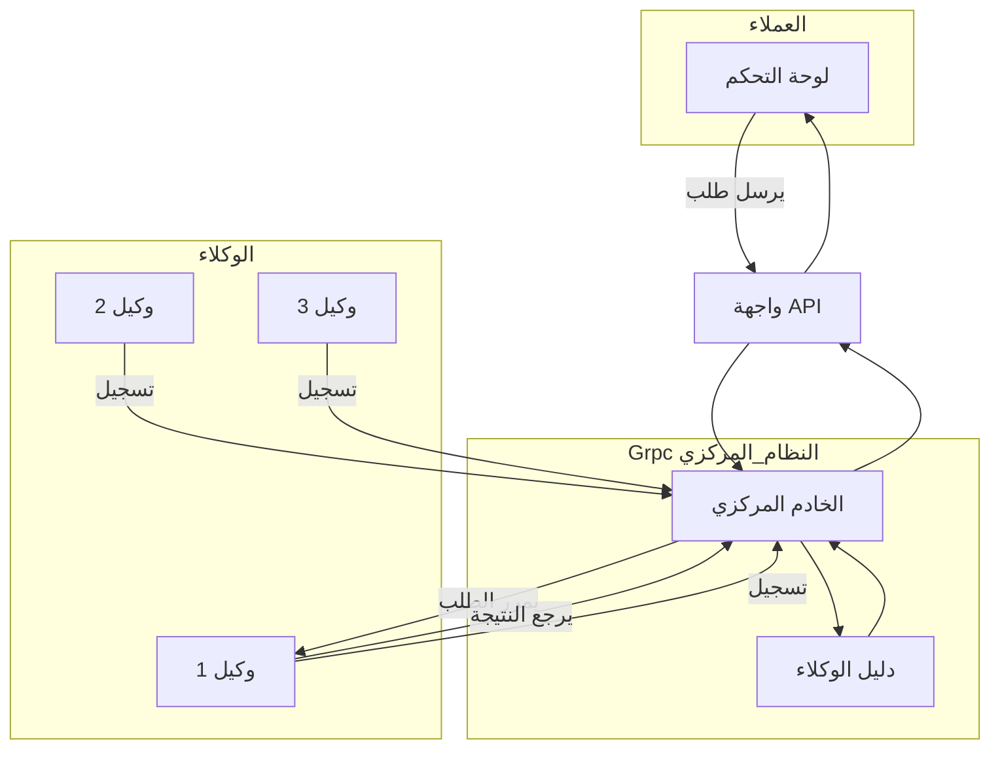
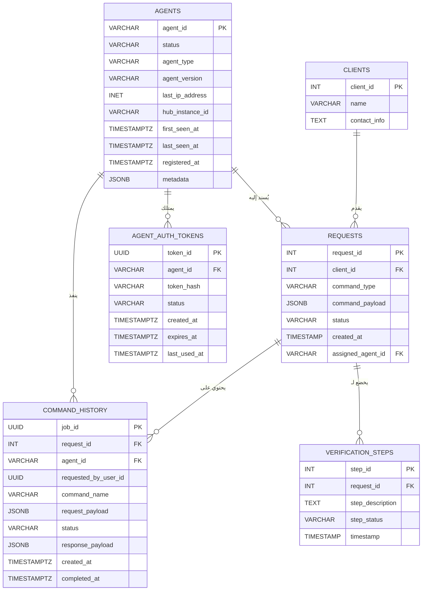

#  التصور الكامل والنهائي: منصة الإدارة المركزية للوكلاء

##  1. الرؤية - (وايش بنسوي؟)

نحن بنبني منصة مركزية تكون زي **برج المراقبة** لجميع الأجهزة والخدمات اللي موزعة في الشركة، سواء كانت خلف جدران نارية أو في شبكات خاصة.  
الهدف هو: **إدارة وتحكم لحظي وآمن** من أي مكان.

---

##  2. المشكلة اللي بنحلها

الأصول التقنية في الشركة (أجهزة، سيرفرات، برامج، شبكات) متفرقة وصعب الوصول لها.  
التحديثات بطيئة، التشخيص مكلف، والأمان معرض للخطر.  
المنصة هذه بتكون **حل جذري** لهذي المشاكل من الأساس.

---

##  3. مكونات النظام الأساسية

النظام بيكون مكوّن من 3 خدمات رئيسية، وكل وحدة لها دورها:

### 1️ الوكيل (Agent) – نقطة البداية
- **وش هو؟** برنامج شغال في الأجهزة الطرفية.
- **وظيفته:** يتواصل مع المركز ويبلغ إنه متصل.
- **مهمتنا:** نفهم كيف يتكلم هذا الوكيل (لغة الاتصال – البروتوكول).

---

### 2️ المركز (Central Hub) – عقل النظام
- **وش هو؟** خادم رئيسي نطوره باستخدام gRPC.
- **وظيفته:**
  - **تسجيل:** يتحقق من هوية كل وكيل، ويسجله في "دليل الأحياء".
  - **وسيط (Proxy):** يستقبل الأوامر من العملاء ويمررها للوكلاء المناسبين.

---

### 3️ واجهة التحكم (Control API) الي هيه api gatway الي هيه firewal 

- **وش هي؟** بوابة خارجية للنظام مبنية باستخدام gRPC.
- **وظيفتها:** تسمح لأي نظام خارجي (Dashboard أو برنامج آلي) يرسل أوامر أو يطلب معلومات عن الوكلاء.

---

## 4. آلية العمل – كيف يشتغل النظام؟

### 📌 التسجيل (Registration)
- الوكيل يبدأ الاتصال.
- المركز يتحقق منه ويسجله.
- الوكيل يظل "متصل بالشبكة" وجاهز يستقبل أوامر.

---

###  الاكتشاف والمسح (Scan / FindMe)
- النظام الخارجي يطلب قائمة الوكلاء النشطين (حسب النوع أو المنطقة).
- المركز يرد بقائمة مباشرة من "الدليل".

---

###  تنفيذ الأوامر (Execution)
- العميل يرسل أمر مخصص لوكيل معين.
- المركز يمرر له الطلب.
- الوكيل ينفذ ويرجع النتيجة.
- المركز يعيد النتيجة للعميل.

---

## 5. خارطة التنفيذ (Implementation Roadmap)

| المرحلة           | المهام                                                  |
| ----------------- | ------------------------------------------------------- |
| الاستكشاف         | نفهم لغة الوكيل، وتحليل البروتوكول اللي يستخدمه.        |
| 2️ النموذج الأولي | نبني نسخة أولية تتعامل مع وكيل واحد فقط.                |
| التطوير الكامل    | تطوير المركز الكامل مع واجهة gRPC ودليل حي للوكلاء.     |
| 4️ التحصين والنشر | نضيف الأمان، نسوي مراقبة، وننشر النظام في بيئة الإنتاج. |

---

##  6. النتيجة النهائية

منصة قوية ومركزية، تمنح الشركة:
- تحكم كامل في الأصول التقنية.
- مراقبة حية وفورية.
- جاهزية لإضافة خدمات ذكية مستقبلًا.
- رفع كفاءة التشغيل، وتقليل التكاليف، وتعزيز الأمان.

---

