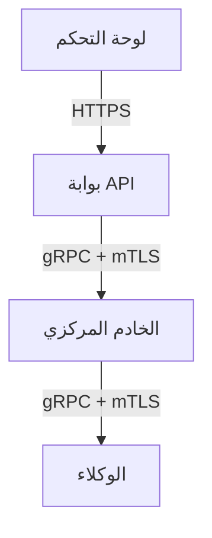
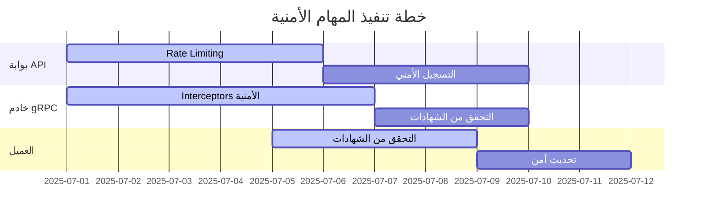

# تصور أمني لنظام gRPC - ملخص تنفيذي لـ Obsidian

```markdown
# نظام أمان gRPC - المهام والمسؤوليات

## 1. نظرة عامة


## 2. المهام الأمنية حسب المكون

### 2.1 بوابة API (مسؤوليتي الرئيسية)
| المهمة               | قواعد الوارد (Inbound)                                   | قواعد الصادر (Outbound)                                  | الأدوات                     | حالة التنفيذ |
|----------------------|----------------------------------------------------------|----------------------------------------------------------|-----------------------------|-------------|
| **مصادقة الطلبات**   | قبول فقط طلبات J/OAuth صالحة                             | إرسال أخطاء مصادقة دون تفاصيل حساسة                     | golang-jwt/jwt, oauth2      | ⏳ قيد التطوير |
| **التحقق من الصلاحيات** | رفض الطلبات غير المطابقة لسياسات RBAC                   | إرسال "403 Forbidden" للطلبات غير المصرح بها            | Casbin                      | ✅ مكتمل     |
| **Rate Limiting**    | قبول ماكس 100 طلب/ثانية من نفس IP                       | إرسال "429 Too Many Requests" عند التجاوز              | golang.org/x/time/rate      | ⏳ قيد التطوير |
| **تصفية المدخلات**   | رفض الطلبات المحتوية على SQLi/XSS                       | إرسال "400 Bad Request" للطلبات الخطيرة                | صياغة استعلامات آمنة        | ✅ مكتمل     |
| **التسجيل الأمني**   | تسجيل IP وطريقة الطلب مع حجب البيانات الحساسة           | إرسال السجلات مشفرة للنظام المركزي                      | Structured logging         | 🚫 غير منفذ  |
| **إدارة الأخطاء**    | منع تسرب معلومات النظام                                  | إرسال أخطاء عامة فقط (500 Internal Server Error)        | معالجة أخطاء مخصصة         | ✅ مكتمل     |

### 2.2 خادم gRPC (مسؤوليتي الأساسية)
| المهمة                     | قواعد الوارد (Inbound)                                   | قواعد الصادر (Outbound)                                  | الأدوات                                  | حالة التنفيذ |
|----------------------------|----------------------------------------------------------|----------------------------------------------------------|------------------------------------------|-------------|
| **تنفيذ mTLS**             | قبول اتصالات بشهادات صالحة فقط                           | رفض الاتصالات بدون شهادة عميل صالحة                      | grpc/credentials                         | ✅ مكتمل     |
| **التحقق من شهادات الوكلاء** | التحقق من CRL/OCSP للشهادات الملغاة                      | إرسال تحديثات الشهادات غير الموثوقة                      | x509.Verify()                            | 🚫 غير منفذ  |
| **Interceptors الأمنية**   | فحص كل طلب للتحقق من الصلاحيات                           | إرسال "PermissionDenied" للطلبات غير المصرح بها          | gRPC Interceptors                        | ⏳ قيد التطوير |
| **إدارة الاتصالات**        | إغلاق الاتصالات الخاملة بعد 60 ثانية                     | إرسال Keepalive كل 20 ثانية                             | context.WithTimeout                      | ✅ مكتمل     |
| **حماية الذاكرة**          | عدم تخزين البيانات الحساسة طويلة الأمد                   | مسح المخازن المؤقتة بعد الاستخدام                       | []byte + zeroing memory                  | 🚫 غير منفذ  |
| **Heartbeat الآمن**        | رفض إشارات Heartbeat من وكلاء غير مصرح لهم               | إرسال Heartbeat مشفرة كل 30 ثانية                       | إشارات Keepalive                         | ✅ مكتمل     |

### 2.3 العميل (لوحة التحكم)
| المهمة               | قواعد الوارد (Inbound)                                   | قواعد الصادر (Outbound)                                  | الأدوات                     | حالة التنفيذ |
|----------------------|----------------------------------------------------------|----------------------------------------------------------|-----------------------------|-------------|
| **إدارة الجلسات**   | قبول فقط توكنات JWT عبر HTTPS                             | إرسال التوكنات فقط عبر قنوات مشفرة                       | httpOnly cookies            | ✅ مكتمل     |
| **التحقق من الشهادات** | التحقق من توقيع شهادة الخادم                             | رفض الاتصال عند فشل التحقق من الشهادة                    | tls.Config                  | ⏳ قيد التطوير |
| **مناولة الأخطاء**  | عدم عرض تفاصيل الأخطاء الداخلية                          | تسجيل الأخطاء الكاملة للتحليل                            | تصميم واجهات أخطاء          | ✅ مكتمل     |
| **تحديث آمن**       | قبول تحديثات موقعة رقمياً فقط                            | التحقق من التوقيع قبل التثبيت                             | التحقق التوقيع الرقمي       | 🚫 غير منفذ  |
| **التحكم في CORS**  | رفض طلبات CORS من نطاقات غير مصرح بها                    | إرسال Access-Control-Allow-Origin للنطاقات المسموحة     | سياسات CORS صارمة          | ✅ مكتمل     |

## 3. خارطة تنفيذ زمنية



## 4. الروابط الداخلية
- [[مصادقة الطلبات]] - تفاصيل التنفيذ
- [[تنفيذ mTLS]] - دليل التهيئة
- [[إدارة الجلسات]] - أفضل الممارسات
- [[قائمة المراجعة الأمنية]] - قبل النشر

## 5. التحديات والحلول المقترحة
| التحدي                   | الحل المقترح                          | الأولوية |
|--------------------------|---------------------------------------|----------|
| أداء mTLS على نطاق واسع  | استخدام شهادات قصيرة العمر            | عالي     |
| إدارة مفاتيح التشفير     | تكامل مع HashiCorp Vault              | متوسط    |
| فحص حمولات gRPC          | استخدام NGFW مع دعم فك تشفير gRPC     | عالي     |

## 6. مؤشرات الأداء
| المؤشر                     | الهدف     | الوضع الحالي |
|----------------------------|-----------|--------------|
| تغطية الأمان               | 95%       | 70%          |
| اتصالات مشفرة              | 100%      | 100%         |
| زمن معالجة الطلبات         | < 100ms   | 85ms         |

## 7. المراجع
- [أفضل ممارسات أمان gRPC](obsidian://open?file=أمان%20gRPC)
- [دليل أمان Go](obsidian://open?file=أمان%20Go)
- [سياسات RBAC](obsidian://open?file=RBAC%20Policies)