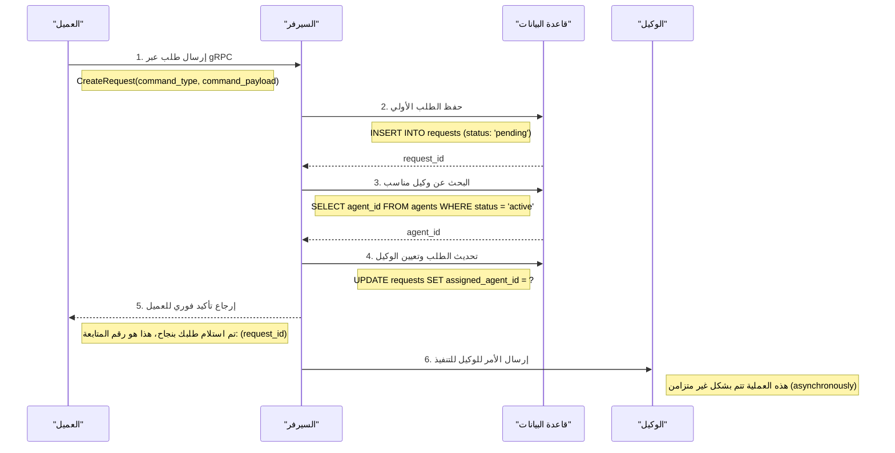

```GO 
package main

import "fmt"

// تعريف Struct يمثل قاعدة جدار الحماية لمكون معين
type FirewallRule struct {
    Component         string   // المكون
    Protocol          string   // البروتوكول
    Ports             []int    // المنافذ
    InboundRules      string   // قواعد الوارد (Inbound)
    OutboundRules     string   // قواعد الصادر (Outbound)
   
}

func main() {
    // إنشاء قائمة بالقواعد حسب الجدول
    rules := []FirewallRule{
        {
            Component:        "لوحة التحكم",
            Protocol:         "HTTPS",
            Ports:            []int{443},
            InboundRules:     "من شبكات الإدارة فقط",
            OutboundRules:    "إلى واجهة API (443)",
          
        },
        {
            Component:        "واجهة API",
            Protocol:         "gRPC / HTTPS",
            Ports:            []int{50051, 443},
            InboundRules:     "من لوحة التحكم (443)",
            OutboundRules:    "إلى الخادم المركزي (50051)",
           
        },
        {
            Component:        "الخادم المركزي",
            Protocol:         "gRPC",
            Ports:            []int{50051},
            InboundRules:     "من واجهة API والوكلاء",
            OutboundRules:    "إلى الوكلاء ودليل الوكلاء",
           
        },
        {
            Component:        "الوكلاء",
            Protocol:         "gRPC",
            Ports:            []int{50051},
            InboundRules:     "من الخادم المركزي فقط",
            OutboundRules:    "إلى الخادم المركزي (50051)",
           
        },
    }

    // عرض القواعد
    for _, rule := range rules {
        fmt.Printf("المكون: %s\n", rule.Component)
        fmt.Printf("البروتوكول: %s\n", rule.Protocol)
        fmt.Printf("المنافذ: %v\n", rule.Ports)
        fmt.Printf("قواعد الوارد: %s\n", rule.InboundRules)
        fmt.Printf("قواعد الصادر: %s\n", rule.OutboundRules)
        fmt.Printf("مستوى الحساسية: %s\n\n", rule.SensitivityLevel)
    }
}

```


---

### 1. جدول العملاء (CLIENTS)

هذا الجدول هو سجل لكل الجهات الخارجية (مثل لوحة التحكم أو البرامج الآلية) المسموح لها بالتحدث مع نظامنا. وظيفته بسيطة: يعرف من هو العميل الذي قدم الطلب.

|   |   |   |
|---|---|---|
|**اسم الحقل (Field Name)**|**النوع (Type)**|**الوصف (Description)**|
|`client_id`|INT|المعرف الرقمي للعميل (مفتاح أساسي - PK)|
|`name`|VARCHAR|اسم العميل|
|`contact_info`|TEXT|معلومات التواصل|

---

### 2. جدول الوكلاء (AGENTS)

هذا الجدول هو العقل المدبر ودليل الهاتف للنظام. يسجل كل وكيل موجود، حالته (شغال أو طافي)، نوعه، وإصداره، وآخر مرة تواصل معنا. الخادم المركزي يستخدم هذا الجدول عشان يعرف من هم الوكلاء المتاحين ويختار أفضلهم لتنفيذ أي مهمة.

|   |   |   |
|---|---|---|
|**اسم الحقل (Field Name)**|**النوع (Type)**|**الوصف (Description)**|
|`agent_id`|VARCHAR|المعرف الفريد للوكيل (مفتاح أساسي - PK)|
|`status`|VARCHAR|حالة الوكيل (مثل: active, inactive)|
|`agent_type`|VARCHAR|نوع الوكيل (مثل: CPE, Core-Switch)|
|`agent_version`|VARCHAR|نسخة برنامج الوكيل|
|`last_ip_address`|INET|آخر عنوان IP اتصل منه الوكيل|
|`hub_instance_id`|VARCHAR|معرف الخادم المركزي الذي يخدمه الوكيل|
|`first_seen_at`|TIMESTAMPTZ|أول مرة اتصل فيها الوكيل|
|`last_seen_at`|TIMESTAMPTZ|آخر مرة أرسل فيها الوكيل نبضة قلب (heartbeat)|
|`registered_at`|TIMESTAMPTZ|وقت بداية الجلسة الحالية للوكيل|
|`metadata`|JSONB|بيانات إضافية (مثل: نظام التشغيل، الموقع الجغرافي)|

---

### 3. جدول الطلبات (REQUESTS)

هذا الجدول هو بمثابة "قائمة المهام" أو "طابور العمليات" في النظام. أي طلب يجي من أي عميل، يتم تسجيله هنا أولاً مع حالته (قيد الانتظار). يتم تحديث حالته خطوة بخطوة حتى يكتمل، وهو يربط بين العميل والوكيل المسؤول عن التنفيذ.

|   |   |   |
|---|---|---|
|**اسم الحقل (Field Name)**|**النوع (Type)**|**الوصف (Description)**|
|`request_id`|INT|المعرف الرقمي للطلب (مفتاح أساسي - PK)|
|`client_id`|INT|يربط بالعميل صاحب الطلب (مفتاح خارجي - FK)|
|`command_type`|VARCHAR|نوع الأمر (مثل: update, query)|
|`command_payload`|JSONB|تفاصيل وبيانات الأمر|
|`status`|VARCHAR|حالة الطلب (مثل: pending, completed, failed)|
|`created_at`|TIMESTAMP|وقت إنشاء الطلب|
|`assigned_agent_id`|VARCHAR|يربط بالوكيل المكلف بالتنفيذ (مفتاح خارجي - FK)|

---

### 4. جدول توكنات المصادقة للوكلاء (AGENT_AUTH_TOKENS)

هذا جدول أمني متخصص. وظيفته هي إدارة توكنات المصادقة الخاصة بالوكلاء، في حال كان النظام يستخدم هذا النوع من المصادقة (بالإضافة إلى mTLS). يخزن نسخة مشفرة (هاش) من التوكن، تاريخ صلاحيته، وحالته، لضمان أن الوكلاء الموثوقين فقط هم من يستطيعون التفاعل.

|   |   |   |
|---|---|---|
|**اسم الحقل (Field Name)**|**النوع (Type)**|**الوصف (Description)**|
|`token_id`|UUID|المعرف الفريد للتوكن (مفتاح أساسي - PK)|
|`agent_id`|VARCHAR|يربط بالوكيل صاحب التوكن (مفتاح خارجي - FK)|
|`token_hash`|VARCHAR|الهاش الخاص بالتوكن (للأمان)|
|`status`|VARCHAR|حالة التوكن (مثل: active, revoked)|
|`created_at`|TIMESTAMPTZ|وقت إنشاء التوكن|
|`expires_at`|TIMESTAMPTZ|تاريخ انتهاء صلاحية التوكن|
|`last_used_at`|TIMESTAMPTZ|آخر مرة استخدم فيها التوكن|

---

### 5. جدول سجل الأوامر (COMMAND_HISTORY)

هذا هو "الأرشيف" أو "السجل الأسود" للنظام. بعد ما أي طلب يكتمل (سواء بنجاح أو فشل)، يتم تسجيل كل تفاصيله هنا بشكل دائم. هذا الجدول مهم جداً للتدقيق الأمني، ومراجعة العمليات، وتحليل أي مشاكل حصلت في الماضي.

|   |   |   |
|---|---|---|
|**اسم الحقل (Field Name)**|**النوع (Type)**|**الوصف (Description)**|
|`job_id`|UUID|معرف فريد لعملية التنفيذ (مفتاح أساسي - PK)|
|`request_id`|INT|يربط بالطلب الأصلي (مفتاح خارجي - FK)|
|`agent_id`|VARCHAR|يربط بالوكيل الذي نفذ الأمر (مفتاح خارجي - FK)|
|`requested_by_user_id`|UUID|معرف المستخدم الذي طلب الأمر|
|`command_name`|VARCHAR|اسم الأمر الفعلي (مثل: get_status)|
|`request_payload`|JSONB|البيانات التي أرسلت للوكيل|
|`status`|VARCHAR|حالة التنفيذ (مثل: completed, failed)|
|`response_payload`|JSONB|الرد الذي جاء من الوكيل|
|`created_at`|TIMESTAMPTZ|وقت إنشاء سجل التنفيذ|
|`completed_at`|TIMESTAMPTZ|وقت اكتمال التنفيذ|

---

### 6. جدول خطوات التحقق (VERIFICATION_STEPS)

هذا الجدول يسمح بتطبيق عمليات موافقة متعددة الخطوات على الطلبات المهمة. فكر فيه كقائمة تحقق (Checklist). قبل تنفيذ طلب حساس، يمكن للنظام أن يتأكد من مرور الطلب بعدة مراحل تحقق، ويتم تسجيل نتيجة كل خطوة هنا.

|   |   |   |
|---|---|---|
|**اسم الحقل (Field Name)**|**النوع (Type)**|**الوصف (Description)**|
|`step_id`|INT|المعرف الرقمي للخطوة (مفتاح أساسي - PK)|
|`request_id`|INT|يربط بالطلب المرتبط بالخطوة (مفتاح خارجي - FK)|
|`step_description`|TEXT|وصف لخطوة التحقق|
|`step_status`|VARCHAR|حالة الخطوة (مثل: success, failed)|
|`timestamp`|TIMESTAMP|وقت تنفيذ الخطوة|

