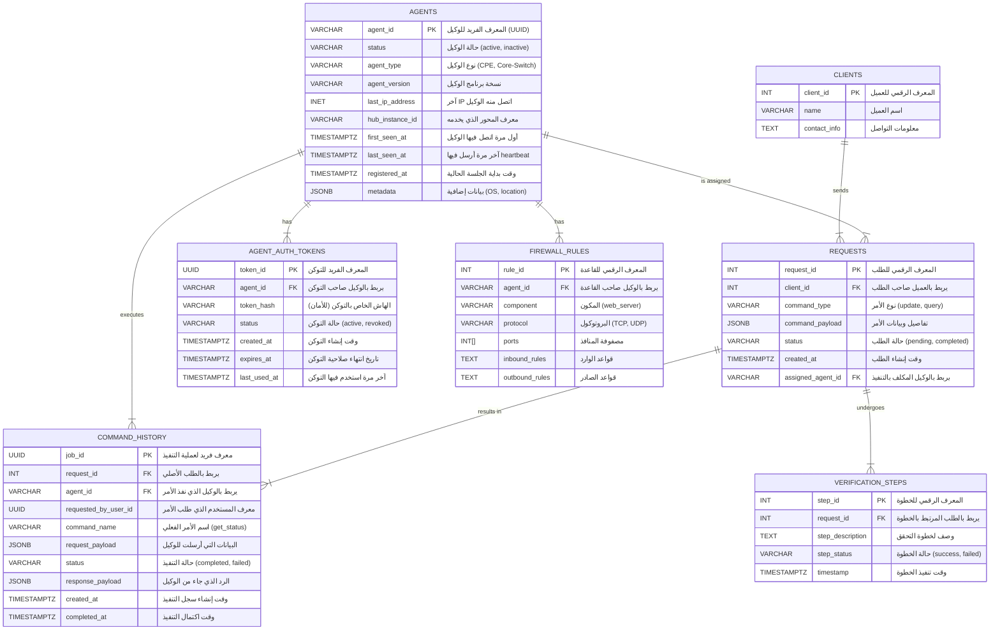

```GO 
package main

import "fmt"

// تعريف Struct يمثل قاعدة جدار الحماية لمكون معين
type FirewallRule struct {
    Component         string   // المكون
    Protocol          string   // البروتوكول
    Ports             []int    // المنافذ
    InboundRules      string   // قواعد الوارد (Inbound)
    OutboundRules     string   // قواعد الصادر (Outbound)
   
}

func main() {
    // إنشاء قائمة بالقواعد حسب الجدول
    rules := []FirewallRule{
        {
            Component:        "لوحة التحكم",
            Protocol:         "HTTPS",
            Ports:            []int{443},
            InboundRules:     "من شبكات الإدارة فقط",
            OutboundRules:    "إلى واجهة API (443)",
          
        },
        {
            Component:        "واجهة API",
            Protocol:         "gRPC / HTTPS",
            Ports:            []int{50051, 443},
            InboundRules:     "من لوحة التحكم (443)",
            OutboundRules:    "إلى الخادم المركزي (50051)",
           
        },
        {
            Component:        "الخادم المركزي",
            Protocol:         "gRPC",
            Ports:            []int{50051},
            InboundRules:     "من واجهة API والوكلاء",
            OutboundRules:    "إلى الوكلاء ودليل الوكلاء",
           
        },
        {
            Component:        "الوكلاء",
            Protocol:         "gRPC",
            Ports:            []int{50051},
            InboundRules:     "من الخادم المركزي فقط",
            OutboundRules:    "إلى الخادم المركزي (50051)",
           
        },
    }

    // عرض القواعد
    for _, rule := range rules {
        fmt.Printf("المكون: %s\n", rule.Component)
        fmt.Printf("البروتوكول: %s\n", rule.Protocol)
        fmt.Printf("المنافذ: %v\n", rule.Ports)
        fmt.Printf("قواعد الوارد: %s\n", rule.InboundRules)
        fmt.Printf("قواعد الصادر: %s\n", rule.OutboundRules)
        fmt.Printf("مستوى الحساسية: %s\n\n", rule.SensitivityLevel)
    }
}

```




